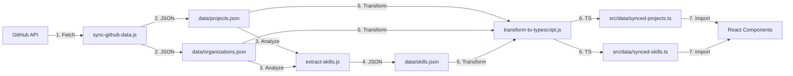

# 🔄 Automatic Portfolio Sync - Implementation Summary

This document summarizes the automatic GitHub portfolio synchronization feature that has been implemented.

## 📋 Overview

The portfolio now automatically syncs with your GitHub account to keep projects and skills up-to-date. This ensures recruiters always see your latest work without manual updates.

## ✅ What Was Implemented

### 1. Data Synchronization Scripts

Three Node.js scripts in the `scripts/` directory:

#### `sync-github-data.js`

- Fetches public repositories from GitHub API
- Fetches organizations you belong to
- Fetches repositories for each organization
- Collects detailed language data for each repository
- Saves data to `data/projects.json` and `data/organizations.json`

#### `extract-skills.js`

- Analyzes programming languages across all repositories
- Categorizes skills (frontend, backend, database, mobile, cloud, tools)
- Calculates skill levels based on usage:
  - **Advanced**: 3+ repositories
  - **Intermediate**: 1-2 repositories
- Saves data to `data/skills.json`

#### `transform-to-typescript.js`

- Converts JSON data to TypeScript format
- Generates `src/data/synced-projects.ts`
- Generates `src/data/synced-skills.ts`
- Includes proper TypeScript interfaces

### 2. NPM Scripts

Added to `package.json`:

```bash
npm run sync:github      # Fetch GitHub data
npm run sync:skills      # Extract skills
npm run sync:transform   # Convert to TypeScript
npm run sync:all         # Run all three
```

### 3. GitHub Actions Workflow

`.github/workflows/sync-portfolio.yml`:

- **Schedule**: Daily at 00:00 UTC
- **Manual trigger**: Via GitHub Actions UI
- **Auto-creates PRs**: With updated data for review

### 4. Documentation

Three comprehensive guides:

- `scripts/README.md` - Script documentation
- `INTEGRATION_GUIDE.md` - Frontend integration guide
- `PORTFOLIO_SYNC_SUMMARY.md` - This summary

### 5. Example Data

- `data/projects.json.example` - Sample repository data
- `data/organizations.json.example` - Sample organization data

## 🎯 How It Works



## 📦 Data Flow

### 1. Manual Execution

```bash
# Set GitHub token (optional, for higher rate limits)
export GITHUB_TOKEN=your_token

# Run sync
npm run sync:all

# Commit generated TypeScript files
git add src/data/synced-*.ts
git commit -m "chore: update synced portfolio data"
git push
```

### 2. Automated Execution (Daily)

```
GitHub Actions (00:00 UTC)
  ↓
Run sync scripts
  ↓
Generate TypeScript files
  ↓
Create Pull Request
  ↓
You review & merge
  ↓
Deploy to Vercel
```

## 🔧 Configuration

### Environment Variables

**For Scripts:**

- `GITHUB_TOKEN` (optional) - GitHub personal access token
- `GITHUB_USERNAME` (default: hoangthai77641)

**For GitHub Actions:**

- `GITHUB_TOKEN` - Automatically provided by GitHub
- Repository owner is auto-detected

### GitHub Token Setup

1. Go to GitHub Settings → Developer settings → Personal access tokens
2. Generate new token (classic)
3. Select scopes: `public_repo`, `read:org`, `read:user`
4. Copy token
5. Use in local environment or add as repository secret

## 📊 Generated Data Structure

### Projects (`synced-projects.ts`)

```typescript
interface SyncedProject {
  title: string; // Repository name (formatted)
  description: string; // Repository description
  technologies: string[]; // Languages + topics
  githubUrl: string; // Repository URL
  liveUrl: string; // Homepage URL
  imageUrl: string; // Default image
  stars: number; // Star count
  updatedAt: string; // Last update date
}
```

### Skills (`synced-skills.ts`)

```typescript
interface SyncedSkillDetail {
  name: string; // Skill name
  level: 'advanced' | 'intermediate' | 'beginner';
  count: number; // Number of repos using this
  repositories: string[]; // List of repo names
}
```

## 🎨 Frontend Integration

The generated TypeScript files can be imported in React components:

```typescript
import syncedProjects from '@/data/synced-projects';
import { syncedSkillsData } from '@/data/synced-skills';

// Use in your components
const MyProjects = () => (
  <div>
    {syncedProjects.map(project => (
      <ProjectCard key={project.title} {...project} />
    ))}
  </div>
);
```

See `INTEGRATION_GUIDE.md` for detailed integration examples.

## 🚀 Deployment

### Vercel Integration

The auto-sync works seamlessly with Vercel:

1. **Automated PRs**: GitHub Actions creates PRs with updated data
2. **Preview Deploys**: Vercel creates preview for each PR
3. **Review Changes**: You can see the portfolio with updated data
4. **Merge**: Once merged, Vercel deploys to production
5. **Live Update**: Portfolio shows latest GitHub data

### Build Process

The synced TypeScript files are included in the Next.js build:

```bash
npm run build  # Includes synced-projects.ts and synced-skills.ts
```

## 📝 Usage Examples

### Show All Projects

```typescript
import syncedProjects from '@/data/synced-projects';

// Display all synced projects
{syncedProjects.map(p => <ProjectCard {...p} />)}
```

### Filter by Organization

```typescript
// Personal projects only
const personalProjects = syncedProjects.filter(p => !p.title.includes('('));

// Organization projects only
const orgProjects = syncedProjects.filter(p => p.title.includes('('));
```

### Top Projects by Stars

```typescript
const topProjects = syncedProjects
  .sort((a, b) => b.stars - a.stars)
  .slice(0, 6);
```

### Display Skills by Category

```typescript
import { syncedSkillsData } from '@/data/synced-skills';

// Show frontend skills
{syncedSkillsData.frontend.map(skill => (
  <SkillBadge
    name={skill.name}
    level={skill.level}
    count={skill.count}
  />
))}
```

## 🔐 Security

- ✅ Only public repositories are fetched
- ✅ No sensitive data is stored
- ✅ GitHub token is optional for local use
- ✅ Automated PRs require manual review before merge
- ✅ Generated files are committed to repository (transparent)

## 🐛 Troubleshooting

### API Rate Limits

**Problem**: GitHub API rate limit exceeded
**Solution**: Set `GITHUB_TOKEN` environment variable

### No Data Generated

**Problem**: Scripts complete but no JSON files
**Solution**:

- Check internet connection
- Verify GitHub username
- Ensure you have public repositories

### TypeScript Errors

**Problem**: Generated files have TypeScript errors
**Solution**: Run `npm run type-check` to verify

### Workflow Not Running

**Problem**: GitHub Actions workflow doesn't trigger
**Solution**:

- Check workflow file is on main branch
- Enable GitHub Actions in repository settings
- Manually trigger via Actions tab

## 📈 Future Enhancements

Potential improvements:

- [ ] Extract README content for descriptions
- [ ] Analyze commit activity for "active" status
- [ ] Detect frameworks from package.json
- [ ] Add project screenshots from repo
- [ ] Calculate project complexity metrics
- [ ] Support private repositories (with token)
- [ ] Generate skill charts/visualizations
- [ ] Add project categorization AI
- [ ] Track portfolio analytics

## 🤝 Maintenance

### Regular Tasks

- **Weekly**: Review automated PRs
- **Monthly**: Verify data accuracy
- **Quarterly**: Update script dependencies

### Updates

- Scripts use Node.js built-ins (no dependencies to update)
- GitHub API v3 is stable
- Workflow uses latest GitHub Actions

## 📞 Support

For issues or questions:

1. Check documentation in `scripts/README.md`
2. Review `INTEGRATION_GUIDE.md` for usage examples
3. Check GitHub Actions logs for errors
4. Verify scripts work locally with `npm run sync:all`

## 🎉 Success Criteria

✅ Scripts successfully fetch GitHub data
✅ Skills are correctly extracted from languages
✅ TypeScript files are properly generated
✅ No TypeScript compilation errors
✅ Build completes successfully
✅ GitHub Actions workflow is configured
✅ Documentation is comprehensive
✅ Example data files provided

## 🌟 Benefits for Recruiters

Your portfolio now:

- ✅ **Always current** - Updates daily automatically
- ✅ **Shows breadth** - All public repos visible
- ✅ **Demonstrates skills** - Auto-categorized technologies
- ✅ **Transparent** - Direct links to GitHub
- ✅ **Professional** - Automated, consistent updates
- ✅ **Low maintenance** - Set it and forget it

---

**Last Updated**: 2025-12-07
**Status**: ✅ Implementation Complete
**Next Step**: Integrate synced data in frontend components (see INTEGRATION_GUIDE.md)
